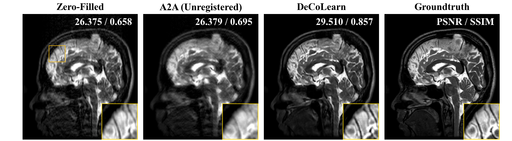

# DeCoLearn: Deformation-Compensated Learning (IEEE Transactions on Medical Imaging, 2022)

This is the official repository of [Deformation-Compensated Learning for Image Reconstruction without Ground Truth](https://ieeexplore.ieee.org/document/9743932).


## Abstract
Deep neural networks for medical image reconstruction are traditionally trained using high-quality ground-truth images as training targets. Recent work on Noise2Noise (N2N) has shown the potential of using multiple noisy measurements of the same object as an alternative to having a ground-truth. However, existing N2N-based methods are not suitable for learning from the measurements of an object undergoing nonrigid deformation. This paper addresses this issue by proposing the deformation-compensated learning (DeCoLearn) method for training deep reconstruction networks by compensating for object deformations. A key component of DeCoLearn is a deep registration module, which is jointly trained with the deep reconstruction network without any ground-truth supervision. We validate DeCoLearn on both simulated and experimentally collected magnetic resonance imaging (MRI) data and show that it significantly improves imaging quality.

## Code

### Download datasets

- Download the brain mri dataset [here](https://drive.google.com/file/d/1qp-l9kJbRfQU1W5wCjOQZi7I3T6jwA37/view) and put it into the `decolearn/dataset` folder.


### Setup Environment
Setup the environment
```
conda env create -n decolearn_env --file decolearn.yml
```
To activate this environment, use
```
conda activate decolearn_env
```
To deactivate an active environment, use
```
conda deactivate
```

### Run
Enter the decolearn folder
```
cd ./decolearn
```

Use the following command to run DeCoLearn
```
python main.py --gpu_index=0 --is_optimize_regis=true
```


Use the following command to run A2A (Unregistered)
```
python main.py --gpu_index=0 --is_optimize_regis=false
```

The training and testing will be conducted sequentially.

Please specify the GPU index (i.e., --gpu_index) based on your resources. No multi-gpu support so far.

### Results
Outputs can be found in `decolearn/experimental_results/`

#### Visual Examples




#### Quantitative Evaluation

|      | Zero-Filled | A2A (Unregistered) | DeCoLearn |
|:----:|:-----------:|:------------------:|:---------:|
| PSNR |    27.85    |       26.48        | **31.87** |
| SSIM |    0.694    |       0.708        | **0.861** |

## Citation

```
@article{gan2021deformation,
  title={Deformation-Compensated Learning for Image Reconstruction without Ground Truth},
  author={Gan, Weijie and Sun, Yu and Eldeniz, Cihat and Liu, Jiaming and An, Hongyu and Kamilov, Ulugbek S},
  journal={IEEE Transactions on Medical Imaging},
  year={2022}
}
```

It is worth mentioning that the brain mri data used in this repo is provided by [here](https://github.com/hkaggarwal/modl). Please consider also cite their paper.

## Supplementary Materials

In this repo, we provide [a supplementary document](./file/supplemental_documents.pdf) showing (a) an illustration of simulated sampling masks, (b) validation with additional levels of deformation, (c) validation with additional sub-sampling rates, (d) an illustration of the influence of the trade-off parameter in Equ. (10) of the paper, and (e) validation on MRI measurements simulated using complex-value ground-truth images.


====

## Code Responsibility per File


### `[decolearn dir] main.py`

----
```diff
+ Responsibility: 

+ Reconstruction module: from torch_util.module import EDSR

+ Registeration module: from torch_util.module import cvpr2018_net as voxelmorph

+ method_dict: Save DeCoLearn file as a dictionary and process training and testing 

+ load_dataset_fn: We use load_synthetic_MoDL_dataset inside of modl.py

- Be careful: 
```
----

* Unfamiliar Methods
----
```diff
+ config.json: Diverse directory path; (Hyper) parameters; training and testing setting.

- Be careful: 
```
----


### `[decolearn dir - dataset dir] modl.py`

----
```diff
+ Responsibility: main.py uses modl.py for core dataset (specifically load_synthetic_MoDL_dataset).

+ def generate_affine_grid(imgSize, translation=(0, 0), reflection=(1, 1), scale=1, rotate=0, shear=(0, 0)):

+ def generate_nonlinear_grid(imgSize, P, theta, sigma, mask):

+ def load_synthetic_MoDL_dataset(...): 

- Be careful: 
```
----

* Unfamiliar Methods
----
```diff
+ torch.view_as_complex(ipt)                   :
      
        >>> x=torch.randn(4, 2)
        >>> x
        tensor([[ 1.6116, -0.5772],
                [-1.4606, -0.9120],
                [ 0.0786, -1.7497],
                [-0.6561, -1.6623]])
        >>> torch.view_as_complex(x)
        tensor([(1.6116-0.5772j), (-1.4606-0.9120j), (0.0786-1.7497j), (-0.6561-1.6623j)])

+ .permute()                                   : Change the order of array dimention

        >>> input_var = torch.randn(3, 5, 2)        # torch.Size([3, 5, 2])
        >>> input_var = input_var.permute(2, 0, 1)  # torch.Size([2, 3, 5])

+ from dataset.torch_mri import generate_mask  :
addwgn function in dataset.torch_mri           : return noised input and noise.

+ for i_shape in tqdm(range(num_shape)): # tqdm is progress visualization tool

+ torch.stack(i, 0)

+ conv_fn = getattr(nn, "Conv{0}d".format(dim)): 

+ 

- Be careful: 
```
----

## `dataset` directory

### `[decolearn dir - dataset dir] torch_mri.py`


----
```diff
+ Responsibility: 

- Be careful: 
```
----

* Unfamiliar Methods
----
```diff
+ Key: 

- Be careful: 
```
----

## `method` directory

### `[method] DeCoLearn.py`

----
```diff
+ Responsibility: 

- Be careful: 
```
----

* Unfamiliar Methods
----
```diff
+ Key: 

- Be careful: 
```
----

## `torch_util` directory

[Done? False]

### `[t_u] module.py`

----
```diff
[Done]
# Basic 
+ conv_block class: Single convolution block with Leaky Relu function in the Unet (Conv + LeakyReLU)

#### Registration ####
[Done]
+ unet_core class: contains encoder and decoder.

        Note: the first layer of encoder has 2 feature mapsto process complex value

+ cvpr2018_net class: 

+ SpatialTransformer class: essentially does linear interpolation

### `[t_u] module.py`

----
```diff
+ Key: Various matrics operations such as PSNR, SSIM, Mean, Stack, and so on.
```
----

[Done]
#### Reconstruction ####
+ ResBlock class: Usual ResBlock.

+ EDSR class: construct 
using multiple ResBlocks to 
```
----

* Unfamiliar Methods
----
```diff
+ nn.ModuleList(): easy to manage block

+ conv_fn = getattr(nn, "Conv{0}d".format(dim)): get the attributes(variables or functions) of class
```
----

### `[t_u] callback.py`

----
```diff
+ Responsibility: Tensorboard
```
----

* Unfamiliar Methods
----
```diff
+ Key: 

- Be careful: 
```
----
